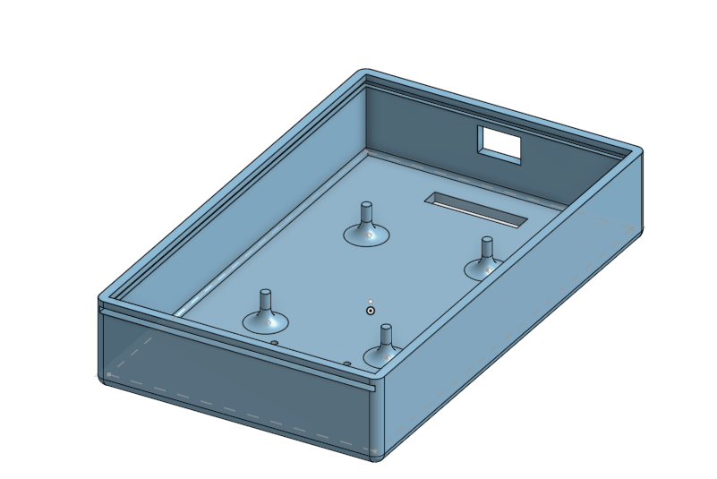

# 1. GABINETES

Os cases do usuário e do motorista foram desenvolvidos utilizando o software gratuito Onshape, disponível em: https://www.onshape.com/en. Inicialmente, os arquivos .STEP das placas foram exportados do Altium e carregados no projeto do Onshape.

Para o case do usuário, o principal objetivo foi criar um invólucro que acomodasse a placa de forma segura, sem ser grande ou pesado, permitindo que fosse facilmente transportado no bolso ou na mochila. Foi necessário atenção especial ao posicionamento do furo para a entrada USB, garantindo acesso sem comprometer a integridade do case. Também se tomou cuidado para que a estrutura não ficasse frágil. Além disso, foram projetadas tampas deslizantes para facilitar a desmontagem e a manutenção do dispositivo.

Já no case do motorista, os cuidados se concentraram em garantir uma caixa mais ergonômica e robusta, capaz de suportar as vibrações constantes do ambiente do ônibus. Assim como no case do usuário, também foram implementadas tampas deslizantes visando a praticidade na manutenção.

Durante o processo, foram identificadas possíveis melhorias futuras nos gabinetes. Uma delas está relacionada ao tipo de impressão 3D: foi utilizada uma impressora de filamento (FDM), porém o uso de uma impressora de resina poderia proporcionar um acabamento mais refinado e maior rigidez. Outra melhoria envolve o dimensionamento mais preciso da entrada USB e dos pontos de fixação dos componentes.

## Case Usuário

  

  

  

  

  

---

## Case Motorista

  

  

## Gabinete

  

  

  

  

---

  <a href="./README.md"><strong>RESUMO</strong></a> 
  <a href="./Introducao.md"><strong>1. INTRODUÇÃO</strong></a> 
  <a href="./Referencial_teorico.md"><strong>2. REFERENCIAL TEÓRICO</strong></a> 
  <a href="./Conclusao.md"><strong>4. CONCLUSÃO</strong></a> 
  <a href="./Referencias_bibliograficas.md"><strong>5. REFERÊNCIAS BIBLIOGRÁFICAS</strong></a>

