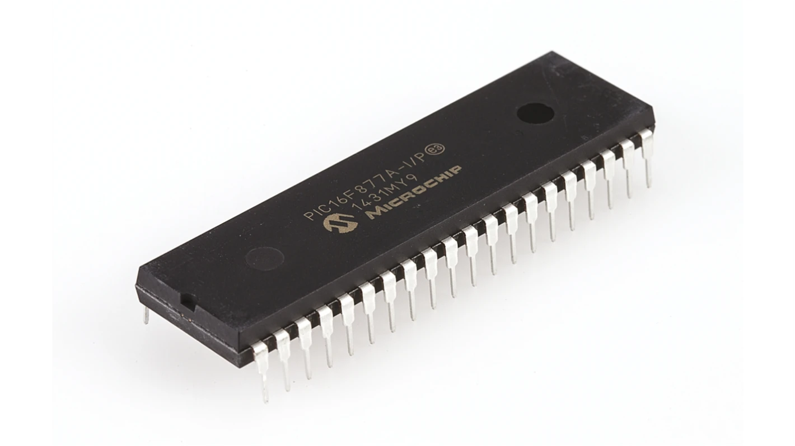
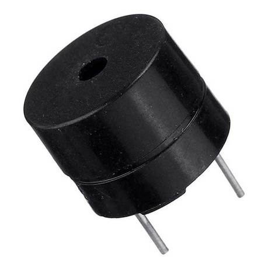
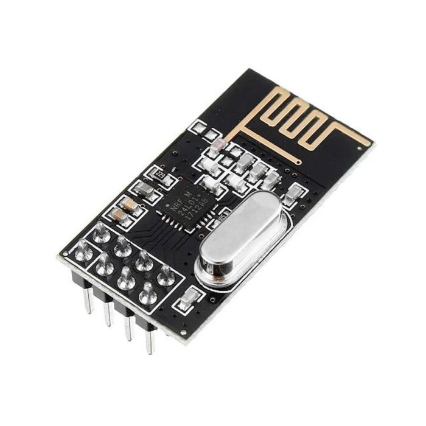
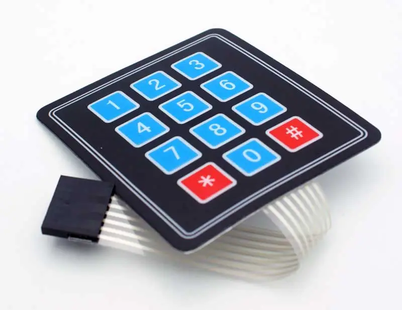
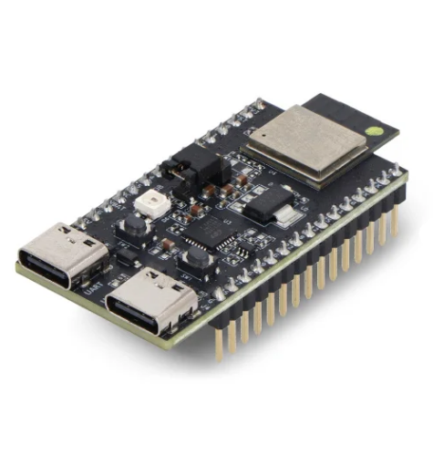
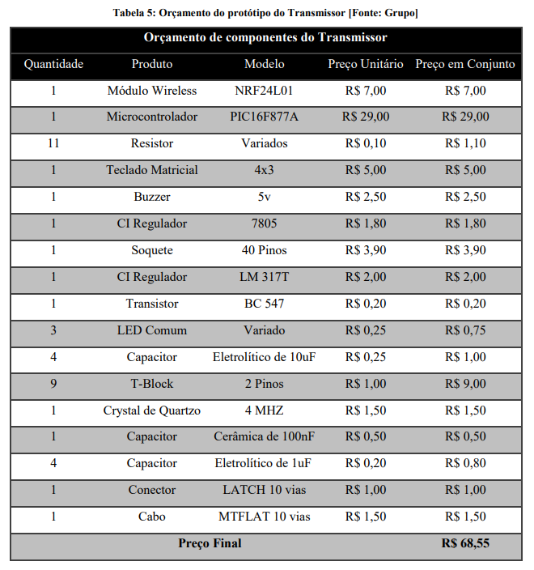
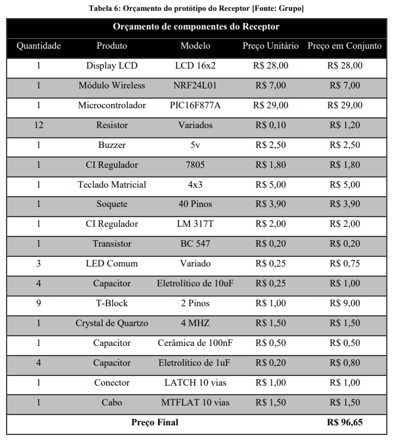
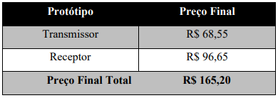
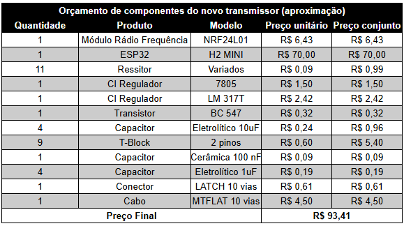
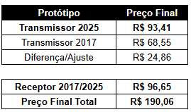

# 3. MATERIAIS E MÉTODOS

## Microcontrolador PIC 16F877A

  

### Características
- Sua frequência de operação chega a 20MHz, sendo utilizado 4MHz;
- Sua velocidade de processamento é de 200ns por ciclo de instrução;
- Possui 40 pinos com 5 portas (A, B, C, D, E) e 33 pinos I/O, sendo que 5 pinos, da porta A, podem ser analógicos;
- Contém baixo consumo de energia, com o Flash da memória EEPROM de alta velocidade e tecnologia.
### Memórias
- Até 8Kb por 14 palavras de memória flash do programa;
- Até 368 por 8 bytes de memória de dados (RAM);
- Até 256 por 8 bytes de memória de dados EEPROM.
### Alimentação
- Sua faixa de tensão de funcionamento vai de 2,0V a 5,5V.
### Periféricos
- Possui 100.000 ciclos de leitura/escrita da memória Flash de programa;
- Possui 1.000.000 ciclos de leitura/escrita de dados da memória EEPROM;
- Retém os dados da memória EEPROM por até 40 anos;
- 4 Temporizadores/Contadores;
- Possibilita interrupção externa através de pinos do microcontrolador.

## Display LCD 16x2

  

## Buzzer

  

## Módulo Wireless NRF24L01

  

### Características
- Acompanha uma antena embutida que opera na frequência de operação de 2,4GHz;
- Sua velocidade de operação vai até 2Mbps;
- Modulação GFSK;
- Comunicação multiponto de 126 canais;
- Possui 8 pinos: GND, VCC, CE, CSN, SCK, MOSI, MISO e IRQ, veja na tabela a seguir suas respectivas funções.

| Pinos | Função |
|-------|--------|
| GND   | Terra  |
| VCC   | Alimentação |
| CE    | Chip Enable RX/TX |
| CSN   | SPI Chip Select |
| SCK   | SPI Clock |
| MOSI  | SPI Slave Data Input |
| MISO  | SPI Slave Data Output |
| IRQ   | Interrupção |

- Modos de operação: Modo de Power Down, de Standby, de TX e de RX, onde serão indicadas abaixo suas funções.

  > **Modo Power Down:** O Módulo Wireless é desativado usando o
consumo de corrente mínimo;

  > **Modo Standby:** Este modo é subdividido em duas categorias: Standby-I e Standby-II. O modo **Standby-I** é usado para minimizar o consumo médio de corrente enquanto mantém tempos de inicialização baixos. E o modo **Standby-II** é quando a memória extra do buffer fica ativa e é usado em comparação com o modo de Standby-I;
  
  > **Modo Transmissor:** É um modo ativo para transmissão de pacotes de dados;
  
  > **Modo Receptor:** É um modo onde o módulo wireless é usado para receber pacotes de dados;

- Tensão de alimentação: 1,9 - 3,6v;
- Corrente de alimentação: Depende de acordo com os modos de operação
programados, veja a seguir nas tabelas.

| Modo de Operação | Corrente |
|------------------|----------|
| Power Down       | 900nA    |
| StandBy-I        | 22uA     |
| StandBy-II       | 320uA    |

- A corrente média para estabelecer o Modo Transmissor é de 8mA, mas altera de acordo com a potência (dBm) programada. Veja na tabela abaixo.

| Potência (dBm) | Corrente |
|----------------|----------|
| 0              | 11,3 mA  |
| -6             | 9 mA     |
| -12            | 7,5 mA   |
| -18            | 7 mA     |
| -6 ShockBurst  | 0,12 mA  |

- A corrente média para estabelecer o Modo Receptor é de 8.4mA, porém tem pequenas variações de acordo com a velocidade de operação programada. Veja na tabela a seguir.

| Velocidade de Operação | Corrente |
|------------------------|----------|
| 1 Mbps                 | 11,8 mA  |
| 1 Mbps com LNA         | 11,1 mA  |
| 2 Mbps                 | 12,3 mA  |
| 2 Mbps com LNA         | 11,5 mA  |

- Filtro anti-interferência;
- O Módulo Wireless NRF24L01 pode atuar como emissor ou receptor, apenas realizando uma configuração por software

## Teclado Matricial 4x3

  

## Microcontrolador ESP32 H2 MINI1

  

### Características
- Sua frequência de operação chega a 96MHz;
- Sua velocidade de processamento é de aproximadamente 10,42 ns por ciclo de instrução (baseado na frequência máxima, contudo depende do tamanho da instrução);
- Possui 53 pinos, dos quais 19 são GPIOs (pinos de entrada/saída de uso geral), sendo que 5 pinos podem ser usados como entradas analógicas;
- Contém baixo consumo de energia, como Light-sleep (85 µA) e Deep-sleep (7 µA).
### Memórias
- Até 4 MB (ou 2 MB, dependendo do modelo) de memória flash integrada para programa e dados;
- Até 320 KB de SRAM (memória de dados) e 4 KB de LP Memory (memória de baixa potência);
- Não possui EEPROM dedicada; a memória flash pode ser usada para armazenamento não volátil.
### Alimentação
- Sua faixa de tensão de funcionamento vai de 3,0 V a 3,6 V, com tensão típica de 3,3 V.
### Periféricos
- Supporte a Zigbee 3.0;
- Possui Bluetoth integrado;
- I2C, I2S, SPI, UART, ADC, LED PWM, ETM, GDMA, PCNT, PARLIO, RMT, TWAI®, MCPWM, USB Serial/JTAG, sensor de temperatura, Timer de uso geral, watchdog timer;
- Possibilita interrupção externa através de qualquer um dos 19 GPIOs, configuráveis para borda ou nível.

## 3.1 Orçamentos
### 3.1.1 Orçamento do primeiro protótipo (2017)
O orçamento abaixo foi feito em 2017 e a compra dos materiais foram em lojas físicas, o que deixa mais caro os componentes, então esse orçamento é apenas uma base pois comprando online em fornecedores e em escala os valores são ainda menores
#### Orçamento do protótipo do transmissor 2017 (usuário/deficiente visual)

  

#### Orçamento do protótipo do receptor 2017 (veículo/ônibus)

  

#### Orçamento total 2017

  

### 3.1.2 Orçamento do novo protótipo (2025)
O orçamento desenvolvido foi com base no antigo, levando em conta que iremos focar apenas no transmissor para fazer o upgrade e, por isso, não mexeremos no receptor. Como não é certo a quantidade de componentes como resistores, capacitores, cabos, ... o custo pode variar tanto pra mais, quanto pra menos. O preço dos componentes internacionais já foram adicionados as taxas e impostos.
#### Orçamento do protótipo do transmissor 2025 (usuário/deficiente visual)

  

#### Orçamento total 2017/2025

  

## 3.2 Metodologia
Utilizando o método de pesquisa experimental foi desenvolvido um protótipo eletrônico para alcançar o objetivo instituído. A construção do mesmo se realizou no campus da Escola Técnica Estadual Henrique Lage - RJ. Iniciou-se a pesquisa para o desenvolvimento do protótipo em 19 de Outubro de 2016 com a busca de informações em torno das dificuldades dos deficientes visuais, ou seja, falta de acessibilidade no serviço de transporte público, dependência das pessoas ao seu redor para se locomover, a falta de inclusão na sociedade, entre outros. Com isso, finalizou-se o protótipo eletrônico, sendo concluído no dia 19 de Outubro de 2017. Em 2025, para a matéria curricular do Projeto Integrador 3 de Engenharia Eletrônica no IFSC - Câmpus Florianópolis, propus a ideia de fazer um upgrade no projeto. 
Este upgrade tem o objetivo de impulsionar ainda mais o uso do dispositivo no contexto atual. O Upgrade será acoplar um dispositivo pequeno atrás do smartphone do usuário conectado pelo USB (allimentação) e por Bluetooth (comandos) para integrar um aplicativo. Assim, o usuário poderá usar o comando de voz para falar a linha de ônibus desejada e também ouvir atualizações sobre a distância, ou até mesmo se o veículo chegou.

### Diagrama em Blocos

---

  <a href="./README.md"><strong>RESUMO</strong></a> 
  <a href="./Introducao.md"><strong>1. INTRODUÇÃO</strong></a> 
  <a href="./Referencial_teorico.md"><strong>2. REFERENCIAL TEÓRICO</strong></a> 
  <a href="./Conclusao.md"><strong>4. CONCLUSÃO</strong></a> 
  <a href="./Referencias_bibliograficas.md"><strong>5. REFERÊNCIAS BIBLIOGRÁFICAS</strong></a>

