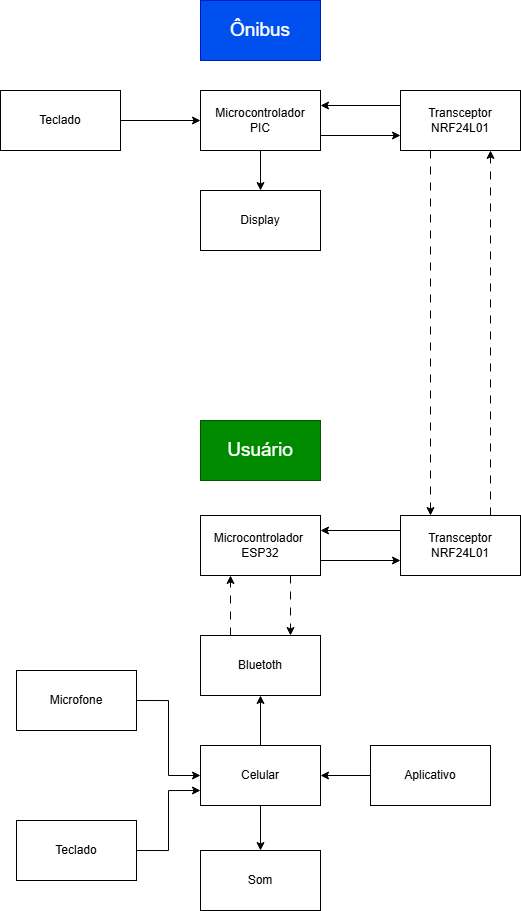
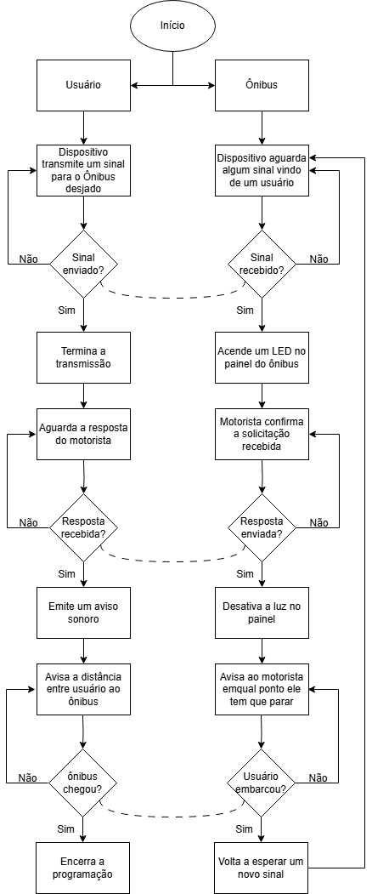
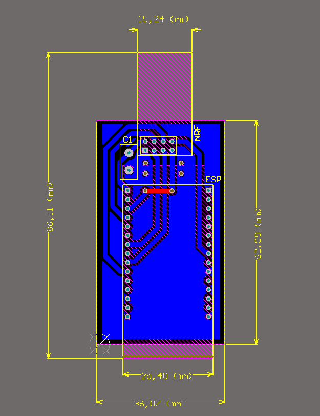
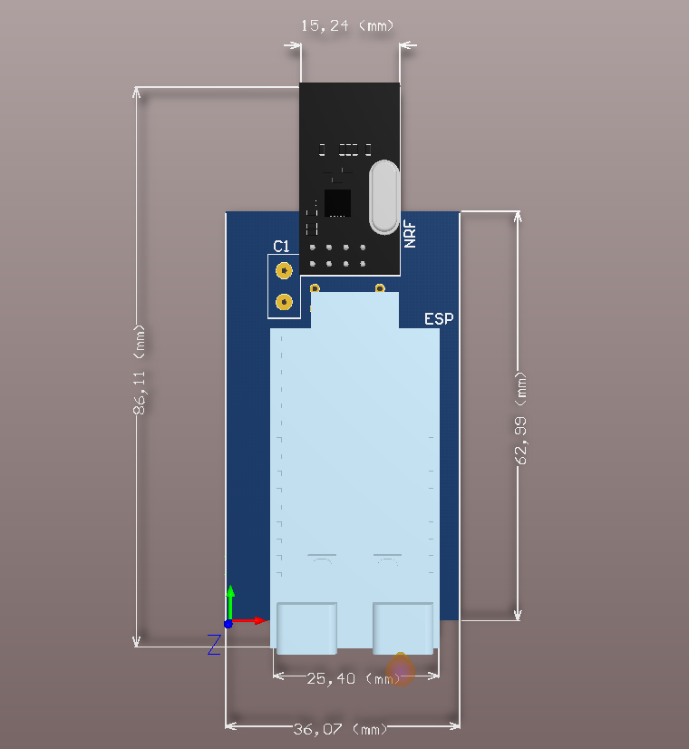

# 3. MATERIAIS E MÉTODOS

## Microcontrolador PIC 16F877A

  

### Características
- Sua frequência de operação chega a 20MHz, sendo utilizado 4MHz;
- Sua velocidade de processamento é de 200ns por ciclo de instrução;
- Possui 40 pinos com 5 portas (A, B, C, D, E) e 33 pinos I/O, sendo que 5 pinos, da porta A, podem ser analógicos;
- Contém baixo consumo de energia, com o Flash da memória EEPROM de alta velocidade e tecnologia.
### Memórias
- Até 8Kb por 14 palavras de memória flash do programa;
- Até 368 por 8 bytes de memória de dados (RAM);
- Até 256 por 8 bytes de memória de dados EEPROM.
### Alimentação
- Sua faixa de tensão de funcionamento vai de 2,0V a 5,5V.
### Periféricos
- Possui 100.000 ciclos de leitura/escrita da memória Flash de programa;
- Possui 1.000.000 ciclos de leitura/escrita de dados da memória EEPROM;
- Retém os dados da memória EEPROM por até 40 anos;
- 4 Temporizadores/Contadores;
- Possibilita interrupção externa através de pinos do microcontrolador.

## Display LCD 16x2

  

## Buzzer

  

## Módulo Wireless NRF24L01

  

### Características
- Acompanha uma antena embutida que opera na frequência de operação de 2,4GHz;
- Sua velocidade de operação vai até 2Mbps;
- Modulação GFSK;
- Comunicação multiponto de 126 canais;
- Possui 8 pinos: GND, VCC, CE, CSN, SCK, MOSI, MISO e IRQ, veja na tabela a seguir suas respectivas funções.

| Pinos | Função |
|-------|--------|
| GND   | Terra  |
| VCC   | Alimentação |
| CE    | Chip Enable RX/TX |
| CSN   | SPI Chip Select |
| SCK   | SPI Clock |
| MOSI  | SPI Slave Data Input |
| MISO  | SPI Slave Data Output |
| IRQ   | Interrupção |

- Modos de operação: Modo de Power Down, de Standby, de TX e de RX, onde serão indicadas abaixo suas funções.

  > **Modo Power Down:** O Módulo Wireless é desativado usando o
consumo de corrente mínimo;

  > **Modo Standby:** Este modo é subdividido em duas categorias: Standby-I e Standby-II. O modo **Standby-I** é usado para minimizar o consumo médio de corrente enquanto mantém tempos de inicialização baixos. E o modo **Standby-II** é quando a memória extra do buffer fica ativa e é usado em comparação com o modo de Standby-I;
  
  > **Modo Transmissor:** É um modo ativo para transmissão de pacotes de dados;
  
  > **Modo Receptor:** É um modo onde o módulo wireless é usado para receber pacotes de dados;

- Tensão de alimentação: 1,9 - 3,6v;
- Corrente de alimentação: Depende de acordo com os modos de operação
programados, veja a seguir nas tabelas.

| Modo de Operação | Corrente |
|------------------|----------|
| Power Down       | 900nA    |
| StandBy-I        | 22uA     |
| StandBy-II       | 320uA    |

- A corrente média para estabelecer o Modo Transmissor é de 8mA, mas altera de acordo com a potência (dBm) programada. Veja na tabela abaixo.

| Potência (dBm) | Corrente |
|----------------|----------|
| 0              | 11,3 mA  |
| -6             | 9 mA     |
| -12            | 7,5 mA   |
| -18            | 7 mA     |
| -6 ShockBurst  | 0,12 mA  |

- A corrente média para estabelecer o Modo Receptor é de 8.4mA, porém tem pequenas variações de acordo com a velocidade de operação programada. Veja na tabela a seguir.

| Velocidade de Operação | Corrente |
|------------------------|----------|
| 1 Mbps                 | 11,8 mA  |
| 1 Mbps com LNA         | 11,1 mA  |
| 2 Mbps                 | 12,3 mA  |
| 2 Mbps com LNA         | 11,5 mA  |

- Filtro anti-interferência;
- O Módulo Wireless NRF24L01 pode atuar como emissor ou receptor, apenas realizando uma configuração por software

## Teclado Matricial 4x3

  

## Microcontrolador ESP32 H2 MINI1

  

### Características
- Sua frequência de operação chega a 96MHz;
- Sua velocidade de processamento é de aproximadamente 10,42 ns por ciclo de instrução (baseado na frequência máxima, contudo depende do tamanho da instrução);
- Possui 53 pinos, dos quais 19 são GPIOs (pinos de entrada/saída de uso geral), sendo que 5 pinos podem ser usados como entradas analógicas;
- Contém baixo consumo de energia, como Light-sleep (85 µA) e Deep-sleep (7 µA).
### Memórias
- Até 4 MB (ou 2 MB, dependendo do modelo) de memória flash integrada para programa e dados;
- Até 320 KB de SRAM (memória de dados) e 4 KB de LP Memory (memória de baixa potência);
- Não possui EEPROM dedicada; a memória flash pode ser usada para armazenamento não volátil.
### Alimentação
- Sua faixa de tensão de funcionamento vai de 3,0 V a 3,6 V, com tensão típica de 3,3 V.
### Periféricos
- Supporte a Zigbee 3.0;
- Possui Bluetoth integrado;
- I2C, I2S, SPI, UART, ADC, LED PWM, ETM, GDMA, PCNT, PARLIO, RMT, TWAI®, MCPWM, USB Serial/JTAG, sensor de temperatura, Timer de uso geral, watchdog timer;
- Possibilita interrupção externa através de qualquer um dos 19 GPIOs, configuráveis para borda ou nível.

## 3.1 Orçamentos
### 3.1.1 Orçamento do primeiro protótipo (2017)
O orçamento abaixo foi feito em 2017 e a compra dos materiais foram em lojas físicas, o que deixa mais caro os componentes, então esse orçamento é apenas uma base pois comprando online em fornecedores e em escala os valores são ainda menores
#### Orçamento do protótipo do transmissor 2017 (usuário/deficiente visual)

  

#### Orçamento do protótipo do receptor 2017 (veículo/ônibus)

  

#### Orçamento total 2017

  

### 3.1.2 Orçamento do novo protótipo (2025)
O orçamento desenvolvido foi com base no antigo, levando em conta que será dado foco apenas no transmissor para fazer o upgrade e, por isso, não será mexido no receptor. Como não é certo a quantidade de componentes como resistores, capacitores, cabos, entre outros componentes, o custo pode variar tanto para mais, quanto para menos. O preço dos componentes internacionais já foram adicionados as taxas e impostos.
#### Orçamento do protótipo do transmissor 2025 (usuário/deficiente visual)

  

#### Orçamento total 2017/2025

  

## 3.2 Metodologia
Utilizando o método de pesquisa experimental foi desenvolvido um protótipo eletrônico para alcançar o objetivo instituído. A construção do mesmo se realizou no campus da Escola Técnica Estadual Henrique Lage - RJ. Iniciou-se a pesquisa para o desenvolvimento do protótipo em 19 de Outubro de 2016 com a busca de informações em torno das dificuldades dos deficientes visuais, ou seja, falta de acessibilidade no serviço de transporte público, dependência das pessoas ao seu redor para se locomover, a falta de inclusão na sociedade, entre outros. Com isso, finalizou-se o protótipo eletrônico, sendo concluído no dia 19 de Outubro de 2017.

Após a confecção de uma placa de circuito impresso que associa um microcontrolador PIC16F877A e transceptores NRF24L01, iniciaram-se testes de modo a comprovar ou não o funcionamento do dispositivo. O objetivo era que, o usuário possa interagir com o motorista em tempo real, a fim de sinalizá-lo que no próximo ponto haverá um deficiente visual solicitando o veículo. Os principais testes foram: verificar a distância máxima do sinal de transmissão em um lugar fechado com obstáculos e em um local aberto sem obstáculos. Outro teste realizado foi analisar a distância máxima em movimento, simulando uma situação real de uma parada de ônibus, onde foi instalado o aparelho em um veículo e variou-se a sua velocidade para determinar o limite de seu ponto de emissão e recepção. Também foi efetuado testes com deficientes visuais para analisar o grau de dificuldade em manusear o dispositivo, a fim de avaliar suas necessidades para sempre atualizar e modificar o aparelho em prol de adequar e englobar as dificuldades dos deficientes visuais a um completo sistema de comunicação pelo controle de acesso do usuário diretamente ao motorista. Verificou-se que o protótipo atingiu excelência em todos os testes, mostrando que a Tecnologia Assistiva desenvolvida potencializou as habilidades funcionais das pessoas com deficiência, reforçando a ideia da utilização de sistemas cada vez mais sofisticados para este fim, com custos extremamente baixos.

Em 2025, para a matéria curricular do Projeto Integrador 3 de Engenharia Eletrônica no IFSC - Câmpus Florianópolis, o grupo propôs a ideia de fazer um upgrade no projeto. 
Este upgrade tem o objetivo de impulsionar ainda mais o uso do dispositivo no contexto atual. O Upgrade tem o objetivo em acoplar um dispositivo pequeno atrás do smartphone do usuário conectado pelo USB (allimentação) e por Bluetooth (comandos) para integrar um aplicativo. Assim, o usuário poderá usar o comando de voz para falar a linha de ônibus desejada e também ouvir atualizações sobre a distância, ou até mesmo se o veículo chegou.

### Viabilidade do Projeto

A viabilidade do projeto é altamente favorável, considerando a evolução tecnológica atual, o fácil acesso a microcontroladores de baixo custo, módulos Bluetooth eficientes e a popularização de smartphones com suporte a conexões USB OTG. A integração do sistema com um aplicativo torna sua utilização ainda mais intuitiva e personalizada, permitindo atualizações frequentes e facilidade de adaptação a novas necessidades dos usuários.

Além disso, a construção do hardware é simples, de baixo custo, e pode ser facilmente escalonada para produção em maior volume. A parte de software (aplicativo) também se mostra viável, visto que pode ser desenvolvida utilizando frameworks acessíveis e com integração simplificada entre o dispositivo e o sistema Android, majoritário entre o público-alvo.

Por fim, o projeto atende a uma necessidade social urgente, o que amplia seu potencial para captação de recursos através de políticas públicas de acessibilidade, editais de inovação, ou parcerias com empresas de transporte público.

## 3.3 Diagrama em Blocos

### 3.3.1 Funcionamento dos Sistemas

As funcionalidades descritas abaixo referem-se ao que cada placa do sistema será capaz de realizar futuramente.

  

### 3.3.1 Funcionamento dos Dispositivos

As funcionalidades listadas abaixo correspondem à previsão de funcionamento do firmware. Elas serão desenvolvidas com foco nas necessidades principais do projeto, podendo ser expandidas ou ajustadas conforme novas demandas surgirem.

  

## 3.4 Placas de circuito Impresso

### 3.4.1 Hardware do Usuário

O hardware do usuário foi desenvolvido com base na placa legada do projeto anterior. Nesta nova versão, a alimentação do módulo NRF24L01 é fornecida diretamente pelo pino 3V3 da placa ESP32-H2-DevKitM-1, eliminando a necessidade de um circuito externo para conversão da tensão de 5V proveniente da porta USB para 3,3V.

Adicionalmente, foi inserido um capacitor de 100 nF entre o pino 3V3 e o GND para filtragem de ruídos. Esse capacitor pode ser substituído por outro de maior capacitância, caso haja necessidade de maior rejeição de ruídos que possam ser conduzidos entre as placas através da linha de alimentação.

A interface de comunicação entre o módulo NRF24L01 e o ESP32 foi configurada com os seguintes pinos:

| Pinos | Função                | Pino no ESP32-H2-DevKitM-1         |
|-------|-----------------------|------------------------------------|
| GND   | Terra                 | GND                                |
| VCC   | Alimentação           | 3V3                                |
| CE    | Chip Enable RX/TX     | GPIO13                             |
| CSN   | SPI Chip Select       | FSPICS0                            |
| SCK   | SPI Clock             | FSPICLK                            |
| MOSI  | SPI Slave Data Input  | FSPID                              |
| MISO  | SPI Slave Data Output | FSPIQ                              |
| IRQ   | Interrupção           | GPIO8                              |

O esquemático elétrico foi desenvolvido utilizando o software Altium Designer e está representado conforme a imagem abaixo:

  

Com base no esquemático, foi desenvolvida uma placa de circuito impresso (PCI) no Altium Designer. As trilhas e pads foram desenhados com larguras maiores para facilitar a fabricação manual, especialmente no processo de transferência térmica com papel glossy. Isso melhora a transferência da tinta para a placa de cobre e reduz falhas durante a corrosão com percloreto de ferro.

Também foi tomado o cuidado de manter as dimensões da placa reduzidas, garantindo que ela seja compacta o suficiente para ser instalada na parte traseira de um gabinete acoplado ao celular.

  

Também foram adicionados os modelos 3D dos componentes e da placa no projeto do Altium Designer, permitindo uma visualização mais realista do dispositivo final. Isso facilita a verificação do encaixe mecânico e auxilia no planejamento do posicionamento dentro do gabinete.

  

### 3.4.2 Hardware do Motorista
Transmissor (controle do deficiente)

Parte Interna (circuito)

Receptor (Motorista)

Parte Interna (circuito - motorista)

### 3.4.3 Aplicativo do Usuário 

VisuTech – Mobilidade e Autonomia para Pessoas com Deficiência Visual
> VisuTech — Tecnologia que guia, conecta e transforma vidas.

O **VisuTech** é um aplicativo inclusivo, pensado especialmente para pessoas com deficiência visual, com o objetivo de facilitar o acesso ao transporte público com mais segurança e independência.

O usuário pode interagir por meio de **comandos de voz** ou **digitação**, de acordo com sua preferência ou necessidade. A funcionalidade por voz permite acesso fácil a informações sobre **rotas de ônibus**, **horários** e **localização dos pontos**, sem a necessidade de tocar na tela ou enxergar as opções. Já o modo de digitação é otimizado com **alto contraste**, **letras ampliadas** e compatibilidade com **leitores de tela**.

A **versão V1.0** marca o início de uma transformação digital mais inclusiva. O **VisuTech** é mais do que um aplicativo — é uma ferramenta de **empoderamento** para que todos possam exercer seu **direito de ir e vir com dignidade e independência**.

Interface acessível e intuitiva

Ao abrir o aplicativo, o usuário se depara com uma interface simples e funcional. A tela principal oferece duas formas de entrada para transmitir a linha de ônibus desejada:

- **Entrada por digitação**: Um teclado numérico em destaque permite que o usuário digite o número da linha com facilidade, utilizando botões grandes e bem espaçados, ideais para pessoas com baixa visão.
- **Entrada por voz**: Um botão com o ícone de microfone possibilita que o usuário diga a linha do ônibus em voz alta, utilizando o sistema de reconhecimento de fala do aplicativo.

Além disso, há botões visuais de **confirmação (verde)** e **cancelamento (vermelho)**, reforçando o controle do usuário sobre suas ações.

## Acessibilidade em primeiro lugar

O VisuTech foi desenvolvido com foco em acessibilidade digital:

- Compatível com leitores de tela
- Teclado com contraste elevado
- Fontes grandes e legíveis
- Navegação simplificada

## Autonomia e inclusão

Este aplicativo representa um avanço significativo no acesso ao transporte urbano, permitindo que pessoas com deficiência visual identifiquem e comuniquem sua linha de ônibus de forma prática, segura e independente.

A **versão V1.0** marca o início de uma transformação digital acessível, promovendo inclusão social e autonomia.

# Como utilizar o aplicativo VisuTech

### 1. **Conectar ao dispositivo**
Logo no topo da tela, há dois botões:

- `Conectar`: Estabelece a comunicação com o dispositivo (por exemplo, um módulo que interage com ônibus ou pontos de parada).
- `Desconectar`: Encerra a conexão com o sistema.

Quando conectado com sucesso, a mensagem **"Conectado"** aparece em verde, confirmando que o app está pronto para uso.

### 2. **Transmissão da linha do ônibus**

Você pode inserir o número da linha de ônibus de duas maneiras:

#### 🟦 **Digitando**
- Use o teclado numérico na tela para digitar o número da linha desejada.
- O botão **"X"** apaga o número digitado.
- O botão **"Enter"** envia a informação para o sistema.

#### 🎤 **Por comando de voz**
- Abaixo do campo de digitação, há o botão de **comando por voz**, com um ícone de microfone.
- Ao tocar no microfone, você pode **dizer o número da linha**, e o aplicativo reconhecerá automaticamente.

### 3. **Indicação de status**
- O texto **"Led ligado"** indica que o LED do dispositivo (possivelmente usado como sinal visual para o motorista ou para o usuário) está ativo.
- Isso pode ser um recurso importante para alertar o motorista sobre a presença de um passageiro com deficiência visual.

## Recursos de acessibilidade

- **Botões grandes e com bom contraste**
- **Interface limpa e objetiva**
- **Reconhecimento de voz para maior autonomia**
- **Compatível com leitores de tela**

Os dois componentes estão inseridos em um **invólucro retangular** projetado para ser fixado na parte traseira do celular. Esse posicionamento permite que o sistema funcione de forma **discreta** e **integrada** ao uso do dispositivo móvel.

O sistema pode ser utilizado para diversas finalidades, como:

- **Comunicação com outro dispositivo por proximidade**
- **Detecção de presença**

---

  <a href="./README.md"><strong>RESUMO</strong></a> 
  <a href="./Introducao.md"><strong>1. INTRODUÇÃO</strong></a> 
  <a href="./Referencial_teorico.md"><strong>2. REFERENCIAL TEÓRICO</strong></a> 
  <a href="./Conclusao.md"><strong>4. CONCLUSÃO</strong></a> 
  <a href="./Referencias_bibliograficas.md"><strong>5. REFERÊNCIAS BIBLIOGRÁFICAS</strong></a>

