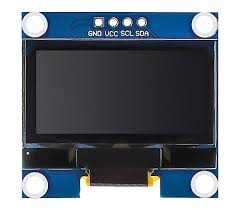
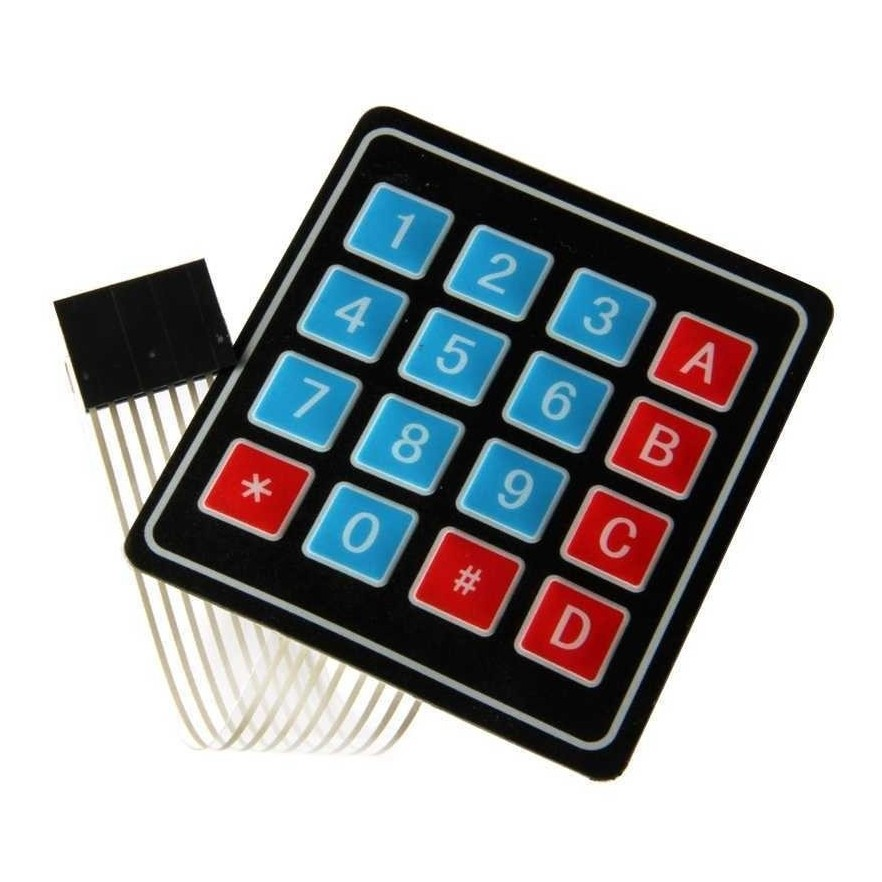
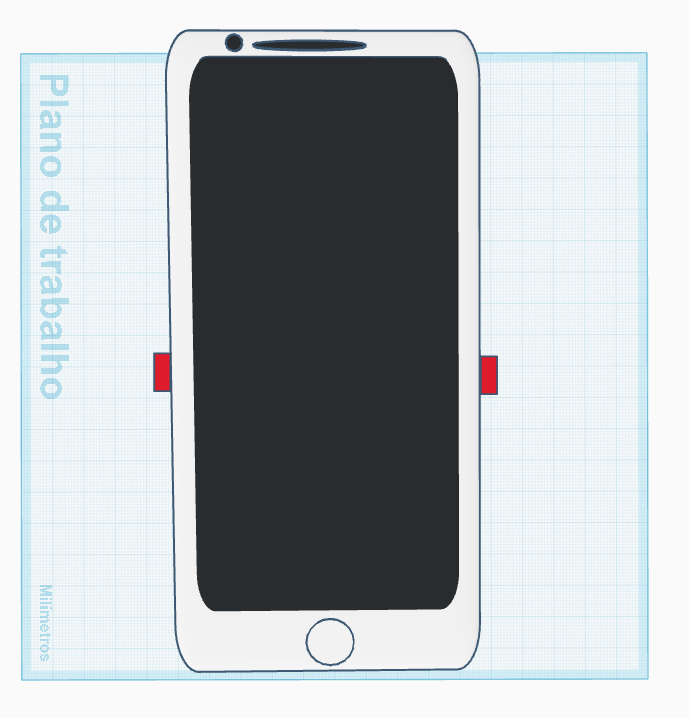
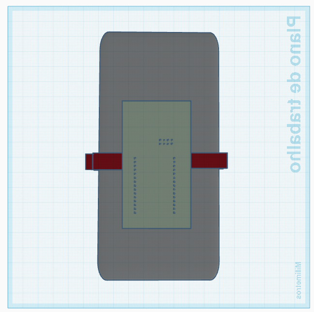
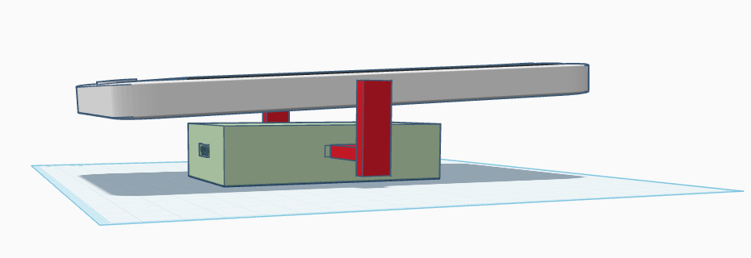
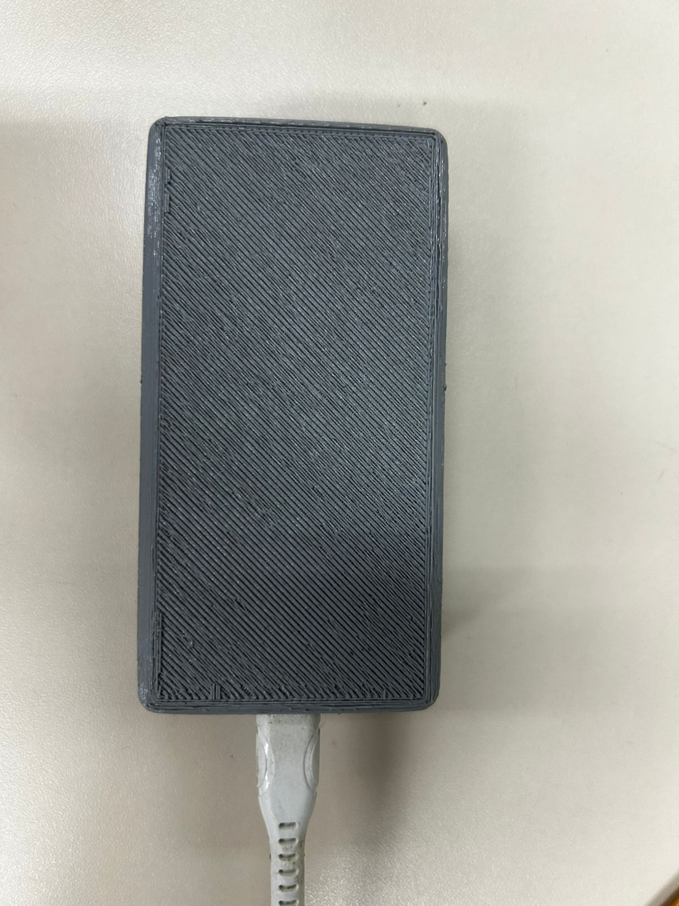
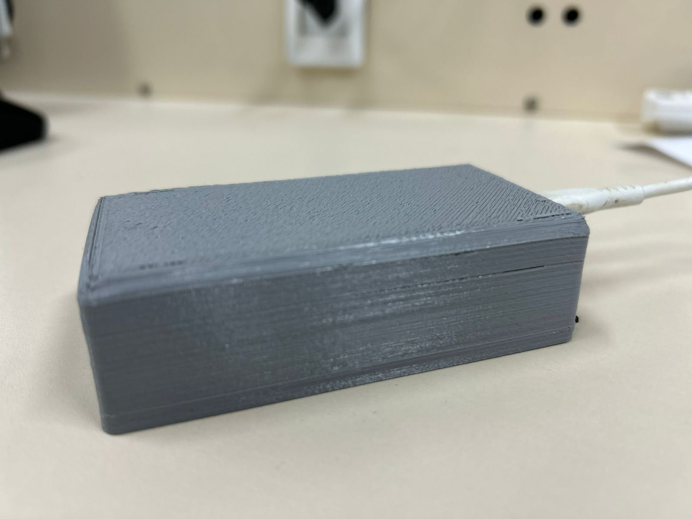

# 3. MATERIAIS E MÉTODOS

## Display OLED

  

## Buzzer

  

## Módulo Wireless NRF24L01

  

### Características
- Acompanha uma antena embutida que opera na frequência de operação de 2,4GHz;
- Sua velocidade de operação vai até 2Mbps;
- Modulação GFSK;
- Comunicação multiponto de 126 canais;
- Possui 8 pinos: GND, VCC, CE, CSN, SCK, MOSI, MISO e IRQ, veja na tabela a seguir suas respectivas funções.

| Pinos | Função |
|-------|--------|
| GND   | Terra  |
| VCC   | Alimentação |
| CE    | Chip Enable RX/TX |
| CSN   | SPI Chip Select |
| SCK   | SPI Clock |
| MOSI  | SPI Slave Data Input |
| MISO  | SPI Slave Data Output |
| IRQ   | Interrupção |

- Modos de operação: Modo de Power Down, de Standby, de TX e de RX, onde serão indicadas abaixo suas funções.

  > **Modo Power Down:** O Módulo Wireless é desativado usando o
consumo de corrente mínimo;

  > **Modo Standby:** Este modo é subdividido em duas categorias: Standby-I e Standby-II. O modo **Standby-I** é usado para minimizar o consumo médio de corrente enquanto mantém tempos de inicialização baixos. E o modo **Standby-II** é quando a memória extra do buffer fica ativa e é usado em comparação com o modo de Standby-I;
  
  > **Modo Transmissor:** É um modo ativo para transmissão de pacotes de dados;
  
  > **Modo Receptor:** É um modo onde o módulo wireless é usado para receber pacotes de dados;

- Tensão de alimentação: 1,9 - 3,6v;
- Corrente de alimentação: Depende de acordo com os modos de operação
programados, veja a seguir nas tabelas.

| Modo de Operação | Corrente |
|------------------|----------|
| Power Down       | 900nA    |
| StandBy-I        | 22uA     |
| StandBy-II       | 320uA    |

- A corrente média para estabelecer o Modo Transmissor é de 8mA, mas altera de acordo com a potência (dBm) programada. Veja na tabela abaixo.

| Potência (dBm) | Corrente |
|----------------|----------|
| 0              | 11,3 mA  |
| -6             | 9 mA     |
| -12            | 7,5 mA   |
| -18            | 7 mA     |
| -6 ShockBurst  | 0,12 mA  |

- A corrente média para estabelecer o Modo Receptor é de 8.4mA, porém tem pequenas variações de acordo com a velocidade de operação programada. Veja na tabela a seguir.

| Velocidade de Operação | Corrente |
|------------------------|----------|
| 1 Mbps                 | 11,8 mA  |
| 1 Mbps com LNA         | 11,1 mA  |
| 2 Mbps                 | 12,3 mA  |
| 2 Mbps com LNA         | 11,5 mA  |

- Filtro anti-interferência;
- O Módulo Wireless NRF24L01 pode atuar como emissor ou receptor, apenas realizando uma configuração por software

## Teclado Matricial 4x4

  

## Microcontrolador ESP32 DevKit-v1

  

### Características Técnicas da ESP32 DevKit V1

#### Processamento
- **Frequência de operação**: Dual-core a 160MHz ou single-core a 240MHz (ajustável)
- **Velocidade de processamento**: ~4.17ns por ciclo (240MHz)
- **Arquitetura**: Xtensa LX6 (32-bit)

#### GPIO e Pinagem
- **Total de pinos**: 38 (na versão DevKit V1)
- **GPIOs disponíveis**: 25 (com restrições de uso)
  - Entradas analógicas: 18 canais ADC de 12-bit
  - Saídas analógicas: 8 canais DAC de 8-bit
- **Pinos especiais**:
  - 16 pinos com touch capacitivo
  - 4 pinos SPI dedicados
  - 2 pinos I2C

#### Consumo Energético
- **Modos de operação**:
  - Ativo: ~160mA (máx.)
  - Modem-sleep: ~20mA
  - Light-sleep: ~0.4mA
  - Deep-sleep: ~10µA

#### Memórias
- **Flash integrada**: 4MB (ESP-WROOM-32)
- **SRAM**: 520KB (sendo 320KB para dados e 200KB para instruções)
- **RTC Fast Memory**: 8KB (para deep-sleep)
- **EEPROM**: Emulada na flash (até 512KB)

#### Alimentação
- **Tensão operacional**: 2.2V a 3.6V
- **Tensão recomendada**: 3.3V
- **Consumo típico**: 80mA em operação normal

#### Conectividade
- **Wi-Fi**:
  - 802.11 b/g/n
  - 2.4GHz
  - Até 150Mbps
- **Bluetooth**:
  - Bluetooth 4.2 BR/EDR
  - BLE

#### Periféricos
- **Interfaces seriais**:
  - 3× UART
  - 2× I2C
  - 2× I2S
  - 3× SPI (1 dedicado para flash)
  
- **Outros periféricos**:
  - 16× PWM LED
  - 2× DAC
  - 10× sensores touch capacitivos
  - 2× timers de watchdog
  - 4× timers de uso geral
  - Interface Ethernet MAC (requer PHY externo)

#### Características Físicas
- **Dimensões PCB**: ~52mm × 28mm
- **Interface de programação**: Micro USB (CP2102)
- **Botões**:
  - Reset
  - Boot (para modo flash)

## 3.1 Orçamentos
### 3.1.1 Orçamento do primeiro protótipo (2017)
O orçamento abaixo foi feito em 2017 e a compra dos materiais foram em lojas físicas, o que deixa mais caro os componentes, então esse orçamento é apenas uma base pois comprando online em fornecedores e em escala os valores são ainda menores
#### Orçamento do protótipo do transmissor 2017 (usuário/deficiente visual)

  

#### Orçamento do protótipo do receptor 2017 (veículo/ônibus)

  

#### Orçamento total 2017

  

### 3.1.2 Orçamento do novo protótipo (2025)
O orçamento desenvolvido foi com base no antigo, levando em conta que será dado foco apenas no transmissor para fazer o upgrade e, por isso, não será mexido no receptor. Como não é certo a quantidade de componentes como resistores, capacitores, cabos, entre outros componentes, o custo pode variar tanto para mais, quanto para menos. O preço dos componentes internacionais já foram adicionados as taxas e impostos.
#### Orçamento do protótipo do transmissor 2025 (usuário/deficiente visual)

  

#### Orçamento total 2017/2025

  

## 3.2 Atualização e Melhorias do Projeto

### 3.2.1 Arquitetura do Sistema Atualizado

O projeto original recebeu significativas melhorias tecnológicas:

**Nova Configuração:**
- **Microcontrolador:** ESP32 DevKit-V1 (substituindo o PIC16F877A)
- **Módulo RF:** NRF24L01+ com alcance de ~60m
- **Interface:** Aplicativo VisuTech + dispositivo

### 3.2.2 Dispositivo do Usuário

#### Hardware
- **Conexões:**
  - MicroUSB para alimentação
  - Bluetooth 4.2 para comunicação
- **Componentes:**
  - ESP32 DevKit-V1
  - Módulo NRF24L01+

#### Aplicativo VisuTech
- **Funcionalidades:**
  - Ativação por gesto (chacoalhar)
  - Comandos por voz (API Google)
  - Geolocalização (API Google)
  - Feedback por voz (Google TTS)

### 3.2.3 Dispositivo Veicular

**Painel do Motorista:**
- Display
- Teclado matricial para seleção de linha
- Botão físico de confirmação
- Alerta sonoro (Buzzer) e visual (Display)

### 3.2.4 Fluxo de Operação

1. Usuário chacoalha o smartphone
2. App solicita comando de voz
3. Usuário fala número da linha
4. Dispositivo transmite via RF (60m)
5. Ônibus recebe sinal e alerta motorista
6. Motorista confirma parada
7. Usuário recebe confirmação por voz

### 3.2.5 Vantagens da Nova Versão

✔ **Autonomia:**  
- Funciona sem internet (apenas RF e BLueTooth)    

✔ **Acessibilidade:**  
- Controle por voz e gestos  
- Feedback por áudio, visual e vibração  

## 3.3 Diagrama em Blocos

### 3.3.1 Funcionamentos dos Sistemas

As funcionalidades descritas abaixo referem-se ao que cada placa do sistema será capaz de realizar futuramente.

#### Sistema do ônibus (painel do motorista)

1. **Teclado Físico**:
   - Interface de entrada para o motorista
   - Permite digitar o número da linha em operação
   - Teclas dedicadas para funções especiais (confirmação, cancelamento)

2. **ESP32**:
   - Processa a entrada do teclado
   - Controla o display de informações
   - Gerencia a comunicação com o módulo RF
   - Algoritmo de verificação de dados

3. **Display**:
   - Mostra em tempo real:
     - Linha selecionada
     - Status da comunicação
     - Alertas de passageiros
   - Interface visual simples para operação em movimento

4. **Transceptor NRF24L01**:
   - Comunicação bidirecional em 2.4GHz
   - Alcance operacional: ~60m em ambiente urbano
  
5. **Sistema de Áudio:**
   - Buzzer para sinalização

#### Sistema do usuário (deficiente visual)

1. Microcontrolador ESP32
- **Função**: Processamento central do dispositivo
- **Conexões**:
  - Bluetooth com smartphone
  - Interface com módulo RF
- **Recursos**:
  - Processamento de comandos em tempo real
  - Bluetooth (BLE 4.2)

2. Transceptor NRF24L01
- **Operação**:
  - Pareamento automático com unidade veicular
  - Transmissão e recepção de dados

3. Aplicativo VisuTech
  **Interfaces**:
   - Reconhecimento de voz integrado (API Google)
   - Ativação por gestos (acelerômetro)
   
  **Funcionalidades**:
   - GPS para localização precisa
   - Sintetizador de voz (TTS) multilíngue

4. Sistema de Áudio
  - Áudio do próprio aparelho celular

  

### 3.3.1 Funcionamento dos Dispositivos

As funcionalidades listadas abaixo correspondem à previsão de funcionamento do firmware. Elas serão desenvolvidas com foco nas necessidades principais do projeto, podendo ser expandidas ou ajustadas conforme novas demandas surgirem.

  

## 3.4 Placas de circuito Impresso

### 3.4.1 Hardware do Usuário

O hardware do usuário foi desenvolvido com base na placa legada do projeto anterior. Nesta nova versão, a alimentação do módulo NRF24L01 é fornecida diretamente pelo pino 3V3 da placa ESP32-H2-DevKitM-1, eliminando a necessidade de um circuito externo para conversão da tensão de 5V proveniente da porta USB para 3,3V.

Adicionalmente, foi inserido um capacitor de 100 nF entre o pino 3V3 e o GND para filtragem de ruídos. Esse capacitor pode ser substituído por outro de maior capacitância, caso haja necessidade de maior rejeição de ruídos que possam ser conduzidos entre as placas através da linha de alimentação.

A interface de comunicação entre o módulo NRF24L01 e o ESP32 foi configurada com os seguintes pinos:

| Pinos | Função                | Pino no ESP32-H2-DevKitM-1         |
|-------|-----------------------|------------------------------------|
| GND   | Terra                 | GND                                |
| VCC   | Alimentação           | 3V3                                |
| CE    | Chip Enable RX/TX     | GPIO13                             |
| CSN   | SPI Chip Select       | FSPICS0                            |
| SCK   | SPI Clock             | FSPICLK                            |
| MOSI  | SPI Slave Data Input  | FSPID                              |
| MISO  | SPI Slave Data Output | FSPIQ                              |
| IRQ   | Interrupção           | GPIO8                              |

O esquemático elétrico foi desenvolvido utilizando o software Altium Designer e está representado conforme a imagem abaixo:

  

Com base no esquemático, foi desenvolvida uma placa de circuito impresso (PCI) no Altium Designer. As trilhas e pads foram desenhados com larguras maiores para facilitar a fabricação manual, especialmente no processo de transferência térmica com papel glossy. Isso melhora a transferência da tinta para a placa de cobre e reduz falhas durante a corrosão com percloreto de ferro.

Também foi tomado o cuidado de manter as dimensões da placa reduzidas, garantindo que ela seja compacta o suficiente para ser instalada na parte traseira de um gabinete acoplado ao celular.

  

Também foram adicionados os modelos 3D dos componentes e da placa no projeto do Altium Designer, permitindo uma visualização mais realista do dispositivo final. Isso facilita a verificação do encaixe mecânico e auxilia no planejamento do posicionamento dentro do gabinete.

  

Foi realizado no software Proteus o esquemático da PCB do Receptor (Motorista), demonstrado na imagem abaixo:

  

### 3.4.2 Hardware Desenvolvido
**Transmissor (controle do deficiente)**

  

**Parte Interna (circuito)**

  

**Receptor (Motorista)**

  

**Parte Interna (circuito - motorista)**

  

### 3.4.3 Aplicativo VisuTech (Usuário) 

VisuTech – Mobilidade e Autonomia para Pessoas com Deficiência Visual
> VisuTech — Tecnologia que guia, conecta e transforma vidas.

O **VisuTech** é um aplicativo pioneiro desenvolvido exclusivamente para pessoas com deficiência visual, transformando seu smartphone em um assistente pessoal para uso do transporte público com total autonomia.

## Como Funciona (Passo a Passo)

1. **Inicialização Inteligente**
   - Ao abrir o app, ele automaticamente:
     - Verifica conexão Bluetooth ("Conectando ao dispositivo...")
     - Anuncia: "Aparelho Conectado"
     - Identifica sua localização: "Você está no ponto:..."

2. **Solicitação de Ônibus (Simples e Intuitivo)**
   - Chacoalhe o celular para ativar
   - Fale o número da linha (exemplo: "221")
   - O app confirma: "Procurando ônibus 221"

3. **Confirmação em Tempo Real**
   - Quando o ônibus chegar no raio de 60m:
     - "Ônibus 221 identificado"
     - "Seu ônibus está chegando"
   - Ao parar no ponto:
     - "Ônibus 221 está no ponto"

## Recursos Exclusivos

 **Controle Total por Voz**  
- Todas as ações são confirmadas por voz  
- Não precisa tocar na tela  

 **GPS Inteligente**  
- Anuncia automaticamente seu ponto de ônibus  
- Avisa em qual ponto de ônibus o usuário se encontra  

 **Alertas Sonoros**  
- Notificação quando o ônibus chegar

  <a href="./code/visutech.md"><strong>Detalhes do código e desenvolvimento do aplicativo VisuTech</strong></a> 

# Case do dispositivo (úsuário)

Os dois componentes estão inseridos em um **invólucro retangular** projetado para ser fixado na parte traseira do celular. Esse posicionamento permite que o sistema funcione de forma **discreta** e **integrada** ao uso do dispositivo móvel.

**Visão frontal**

  

**Visão traseira**

  

**Visão inferior**

  

**Visão lateral**

  

### Case desenvolvido

  

  

  

---

  <a href="./README.md"><strong>RESUMO</strong></a> 
  <a href="./Introducao.md"><strong>1. INTRODUÇÃO</strong></a> 
  <a href="./Referencial_teorico.md"><strong>2. REFERENCIAL TEÓRICO</strong></a> 
  <a href="./Conclusao.md"><strong>4. CONCLUSÃO</strong></a> 
  <a href="./Referencias_bibliograficas.md"><strong>5. REFERÊNCIAS BIBLIOGRÁFICAS</strong></a>

