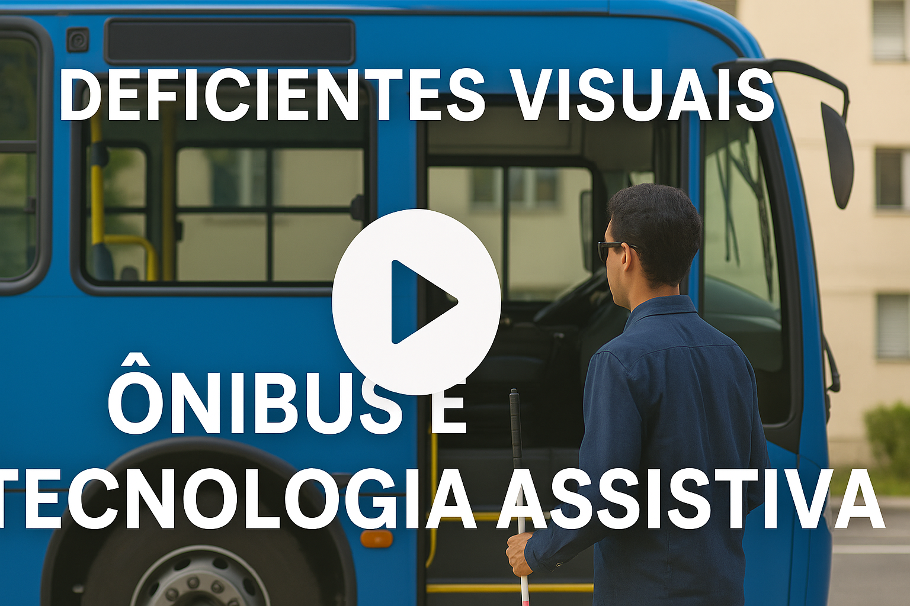

# PI3-2025-1

# Dispositivo Interativo com o transporte público para Deficiente Visual

> Repositório destinado para o desenvolvimento do projeto da discipliana de PI3 - Projeto Integrador 3 

> Alunos: Gabriel de Oliveira Peres, Fellipe Carvalho Araújo Costa e Eduardo Francisco Pereira

# Resumo

Pegar ônibus, por vezes, é uma tarefa complicada. Os atrasos, causados pelo caos do trânsito nas grandes cidades, transformam o cotidiano de muitos brasileiros que dependem do transporte coletivo para trabalhar, estudar, passear, fazer compras, entre outras atividades, em uma luta constante. Se essa realidade já é desafiadora para a maioria dos usuários, para os deficientes visuais a situação é ainda mais complexa. A falta de acessibilidade e a necessidade constante de pedir auxílio às pessoas ao redor para embarcar no ônibus correto tornam o uso do transporte público uma verdadeira batalha diária, gerando sentimentos de exclusão devido às suas limitações.

As dificuldades enfrentadas por deficientes visuais, como mobilidade reduzida, condições precárias de acessibilidade e dependência para utilizar o transporte coletivo, evidenciam a urgente necessidade de avanços na inclusão nas cidades brasileiras.

Pensando nisso, o projeto desenvolvido (2017) busca facilitar o uso do transporte público por deficientes visuais, promovendo maior acessibilidade, independência e inclusão. O aparelho se baseia em dois transceptores onde um deles se localiza instalado dentro do transporte público e o outro com o deficiente visual. Assim que o usuário digitar o numero do ônibus desejado no teclado em seu transceptor, este emitirá um sinal constante na distância entre os pontos de ônibus. O transceptor instalado no ônibus receberá o sinal e avisará ao motorista que este deve parar no próximo ponto, pois haverá um deficiente visual esperando aquele transporte. Assim que chegar ao ponto de parada solicitado, o motorista do ônibus apertará um botão transmitindo ao usuário que o avisará da presença do transporte no ponto.

### 🎬 Demonstração em vídeo do Dispositivo (2017)
###### Vídeo desenvolvido pelo Gabriel Peres no ano de 2017 para participação na FEBRACE 2018

  

A ideia proposta para a atividade curricular do Projeto Integrador 3, na faculdade de Engenharia Eletrônica do IFSC - Câmpus Florianópolis, consiste no upgrade deste sistema:

1. **Transceptor do usuário**: Carregado pelo deficiente visual, será acoplado ao smartphone por meio do Bluetooth (Integração de comunicação) e USB (Parte da alimentação do circuito). Será desenvolvido um aplicativo para integração de uma interface simples com comando de voz e teclas, onde o usuário digita ou fale o número do ônibus desejado. Ao fazer isso, o dispositivo emite um sinal constante na área entre os pontos de ônibus.
2. **Transceptor do ônibus**: Instalado no transporte público, recebe o sinal enviado pelo transceptor do usuário e alerta o motorista para parar no próximo ponto, indicando que um deficiente visual está aguardando aquele ônibus. Quando o ônibus chega ao ponto solicitado, o motorista pressiona um botão que envia um sinal de volta ao transceptor do usuário, informando-o da presença do transporte no local. 

Essa solução visa proporcionar maior autonomia e segurança aos deficientes visuais, contribuindo para uma cidade mais inclusiva e acessível.

<strong>SUMÁRIO</strong>

  <a href="./Introducao.md"><strong>1. INTRODUÇÃO</strong></a> 
  <a href="./Referencial_teorico.md"><strong>2. REFERENCIAL TEÓRICO</strong></a> 
  <a href="./Materiais_e_metodos.md"><strong>3. MATERIAIS E MÉTODOS</strong></a> 
  <a href="./Conclusao.md"><strong>4. CONCLUSÃO</strong></a> 
  <a href="./Referencias_bibliograficas.md"><strong>5. REFERÊNCIAS BIBLIOGRÁFICAS</strong></a>

