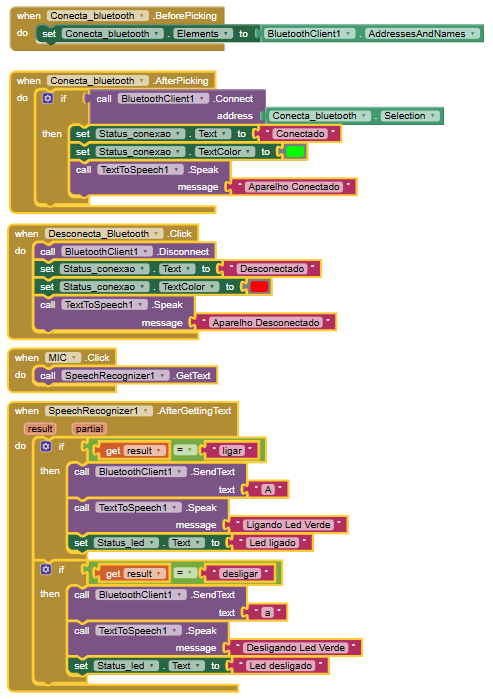

# Códigos

## 1. Código para Teste

O código desenvolvido é apenas para fins de teste e, por isso, foram feitas algumas alterações a nível experimental. O professor disponibilizou uma **ESP32-H2 DevKit**, porém não conseguimos dar seguimento aos testes nela. Portanto, utilizamos uma **ESP32 LOLIN DevKit** para realizar os testes necessários.

Com o objetivo de prototipar rapidamente, utilizamos a **IDE do Arduino** para testar o funcionamento da comunicação **Bluetooth**, com o acionamento simples de um **LED**.

```cpp
#include "BluetoothSerial.h"

const int ledPin = 22;  // Use GPIO22 para o LED
String device_name = "VisuTech";

// Verifica se o Bluetooth está habilitado
#if !defined(CONFIG_BT_ENABLED) || !defined(CONFIG_BLUEDROID_ENABLED)
#error Bluetooth não está habilitado! Execute `make menuconfig` e habilite-o
#endif

// Verifica se o Serial Port Profile está disponível
#if !defined(CONFIG_BT_SPP_ENABLED)
#error Serial Port Profile para Bluetooth não está disponível ou não está habilitado. Ele está disponível apenas para o chip ESP32.
#endif

BluetoothSerial SerialBT;

void setup() {
  Serial.begin(115200);
  SerialBT.begin(device_name); // Inicializa Bluetooth com o nome do dispositivo
  pinMode(ledPin, OUTPUT);     // Define o pino do LED como saída
}

void loop() {
  char dados;
  dados = SerialBT.read();     // Lê os dados recebidos via Bluetooth
  
  if (dados == 'A') {
    digitalWrite(ledPin, HIGH); // Liga o LED
  }
  if (dados == 'a') {
    digitalWrite(ledPin, LOW);  // Desliga o LED
  }
}
```

---

### 1.1 Aplicativo Android

Para desenvolver o aplicativo android, foi utilizado o APP Inventor.

<div style="text-align: center; padding: 10px;">
  
</div>

### 1.2 Teste do código + aplicativo android

Compilando o código para testar a comunicação bluetooth da ESP32 e fazendo o download do aplicativo no celular, seguimos para testar.
Adicionei no teste o comando por voz com uma API do Google por meio do APP Inventor, uma opção que irá ajudar muito no desenvolvimento do aplicativo final.
Os testes foram bem sucessididos e iremos apresentar aos professores na aula.
A próxima etapa será ligar o NRF24L01 por meio da interface SPI e passar o pacote de dados para ser transmitido por RF
