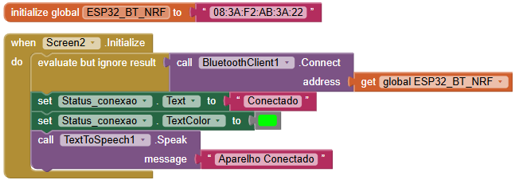
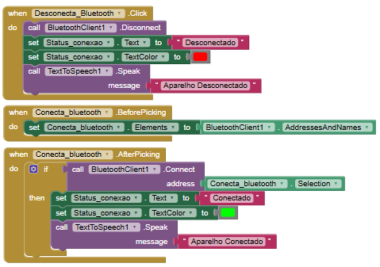
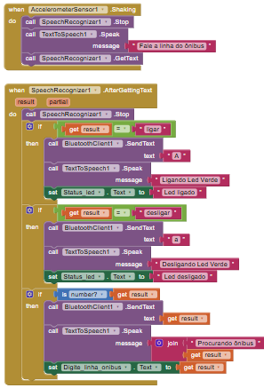
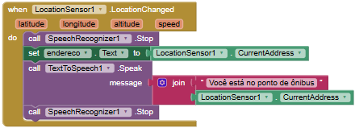
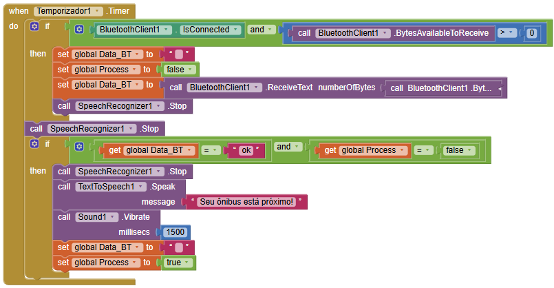
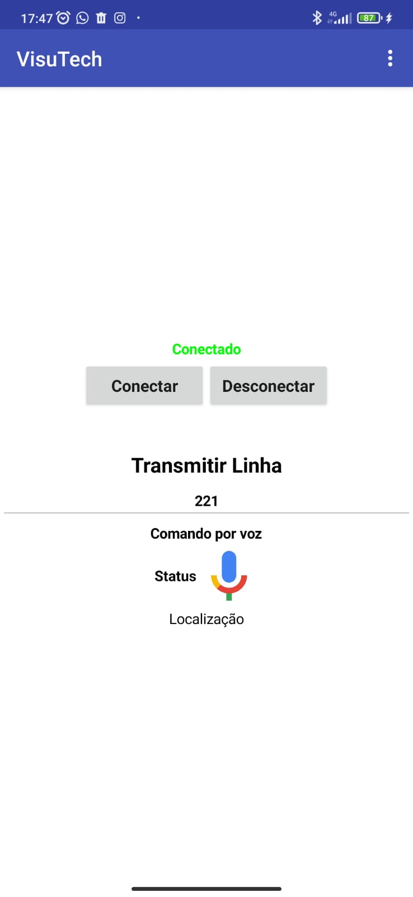

# Desenvolvimento do Aplicativo

## 🛠️ Ferramentas Utilizadas

### Design de Interface
**Figma**  
- Criação do mockup inicial  
- Desenvolvimento das telas:  
  - Tela de carregamento  
  - Tela principal com componentes de voz  
  - Layout acessível com alto contraste  

### Plataforma de Desenvolvimento  
**MIT App Inventor**  
- Programação visual por blocos  
- Componentes integrados:  
  - Google Text-to-Speech API  
  - Reconhecimento de voz  
  - Sensores (acelerômetro, GPS)  
  - Comunicação Bluetooth  

## 🔧 Arquitetura Técnica

### Módulos Principais

| Componente | Função | Implementação |
|-----------|--------|---------------|
| Controle por Voz | Processa comandos do usuário | Google Speech API |
| Localização | Identifica ponto de ônibus | GPS + Geocoding |
| Comunicação | Conecta com dispositivo ESP32 | Bluetooth BLE |
| Feedback | Fornece respostas auditivas | TTS Google |

## 🧩 Blocos Lógicos Desenvolvidos

1. **Conexão Bluetooth**
   - Pairing automático com dispositivo  
   - Monitoramento contínuo da conexão  

  

  

2. **Processamento de Comandos**
   - Filtro para identificar apenas números de linhas válidos  
   - Validação por expressão regular
  

  

  

3. **Sistema de Localização**
   - Identificação automática do ponto
  

  

  

4. **Temporizadores**
   - Espera por confirmação (3s)
   - Retentativas automáticas

  

  

## 📱 Tela final no celular

  

  

  

  
